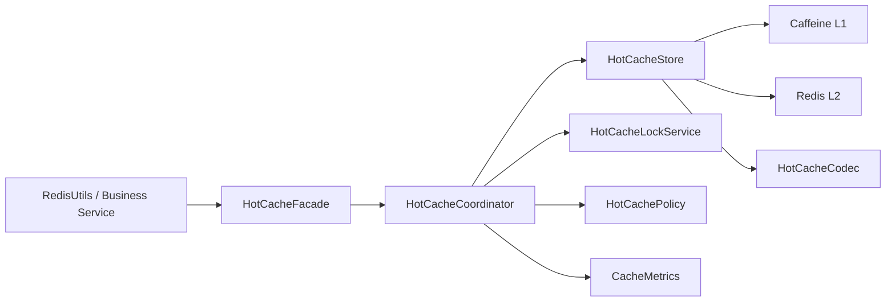

# Hot Cache Enterprise Refactor Design

## Background

`HotCacheService` already uses the right high-level idea for hot-key protection:

- logical expiration
- Redis distributed locking
- local L1 cache + Redis L2 cache
- stale-value fallback

However, the current implementation still has several reliability gaps that prevent it from being treated as enterprise-grade cache infrastructure:

- lock owner token is not unique per acquisition
- lock TTL is fixed and has no renewal
- `preload()` and normal write path are inconsistent
- null caching semantics are ambiguous
- first-load high-concurrency miss is not fully controlled
- stale fallback has no explicit boundary
- observability is incomplete

This design proposes a high-standard refactor aimed at production-grade correctness, operability, and maintainability under high concurrency.

## Goals

- Preserve current business-facing usage style as much as possible
- Eliminate hidden concurrency and cache lifecycle bugs
- Make stale-data fallback explicit and bounded
- Make null caching behavior explicit and correct
- Ensure all hot-cache writes go through one standard path
- Improve testability and observability
- Support future evolution of lock, codec, and storage strategies

## Non-Goals

- Unify all cache implementations in the project into one generic framework
- Replace every existing caller immediately
- Introduce a full external cache platform abstraction in this iteration

## Current Problems

### 1. Lock ownership is unsafe

Current lock ownership is derived from a bean-level `instanceId`, not a unique token per lock acquisition. This can cause incorrect unlocks when:

- a lock expires and is reacquired by another thread or instance
- the previous owner still executes `unlock()`

### 2. Fixed lock TTL without renewal

If source loading exceeds the lock TTL, multiple instances can rebuild the same hot key concurrently.

### 3. Inconsistent write paths

`preload()` writes Redis differently from the main `write()` path. This causes TTL drift and behavior inconsistency.

### 4. Null caching is semantically broken

`null` is currently overloaded to mean both:

- cache miss
- cached empty result

That leads to repeated source loads for non-existent data.

### 5. Cold-start hot miss is not controlled well enough

When a key is first requested under burst traffic, lock losers can still fall through to source load if no stale value exists.

### 6. Stale serving has no hard limit

Current stale fallback does not clearly define how old data is allowed to be before it must stop being served.

### 7. Observability is insufficient

The hot-cache flow lacks enough metrics and structured diagnostics to support safe production operations.

## Proposed Architecture

The refactor introduces a componentized hot-cache core.



### Component Responsibilities

#### HotCacheFacade

Stable business-facing entry point.

Responsibilities:

- preserve current `getOrLoadHot`-style calling model
- convert old call signatures into internal options
- keep business code insulated from internal refactor

Must not own:

- lock logic
- Redis read/write details
- JSON parsing details

#### HotCacheCoordinator

Primary workflow orchestrator.

Responsibilities:

- read current cache state
- classify result as miss, fresh, stale, or cached-null
- decide whether to rebuild
- coordinate source load and fallback behavior

Must not own:

- low-level Redis calls
- lock token generation
- serialization implementation

#### HotCacheStore

Single source of truth for hot-cache storage behavior.

Responsibilities:

- read from L1/L2
- write to L1/L2
- enforce logical TTL and physical TTL conventions
- store null sentinel semantics
- expose stale-read eligibility

All hot-cache writes must go through this component.

#### HotCacheLockService

Distributed lock abstraction for hot-cache rebuild.

Responsibilities:

- create a unique token per lock acquisition
- acquire Redis lock
- renew lock while source load is running
- release lock safely using compare-and-delete

#### HotCacheCodec

Serialization boundary for hot-cache records.

Responsibilities:

- encode `HotCacheRecord<T>` to Redis payload
- decode payload into strongly typed record
- isolate `ObjectMapper` details from workflow code

#### HotCachePolicy

Central configuration object for hot-cache strategy.

Responsibilities:

- logical TTL
- physical TTL
- null TTL
- max stale TTL
- lock TTL
- lock renewal interval
- retry wait duration

No hot-cache magic numbers should remain outside this policy.

## Data Model

Replace the current implicit wrapper with an explicit record model:

```java
public class HotCacheRecord<T> {
    private T data;
    private boolean nullValue;
    private long logicalExpireAt;
    private long physicalCreatedAt;
}
```

### Rationale

This model separates four different states clearly:

- no cache entry exists
- cached null exists
- fresh cached data exists
- stale cached data exists

`nullValue` is required so that cached-empty results are not confused with a miss.

`logicalExpireAt` is used to decide freshness.

`physicalCreatedAt` supports:

- stale-age diagnostics
- stale-window enforcement
- troubleshooting of old payloads

## Read Workflow

### Fresh Hit

1. Read L1
2. If L1 miss, read Redis and populate L1
3. If record exists and is logically fresh:
   - return data immediately
   - if `nullValue = true`, return `null` as a valid cached-null hit

### Stale Hit with Rebuild

1. Read stale record
2. Attempt distributed lock acquisition
3. If lock acquired:
   - start lock renewal
   - call source loader
   - write fresh record through `HotCacheStore`
   - release lock
   - return fresh result

### Stale Hit without Lock

1. Read stale record
2. Lock acquisition fails
3. If stale record age is within `maxStaleTtl`:
   - return stale result
4. Otherwise:
   - wait briefly
   - re-read cache once
   - if still unavailable, enter controlled fallback path

### First Miss under High Concurrency

This is the most important behavioral upgrade.

Recommended strategy:

- same JVM: use per-key inflight coalescing to avoid repeated Redis/source work
- cross JVM: only lock holder may rebuild
- lock losers:
  - wait briefly
  - re-read cache
  - if still missing, do not allow uncontrolled full fan-out to source

Controlled fallback options depend on business requirements:

- allow limited parallel source loads with semaphore control
- return a business-level busy response
- degrade to asynchronous rebuild if supported

The exact fallback policy should be configurable, but uncontrolled database fan-out must not remain.

## Write Workflow

All write scenarios must use the same storage path:

- rebuild after source load
- preload
- cached-null write

Recommended API:

```java
interface HotCacheStore {
    <T> void writeFresh(String key, T value, HotCacheOptions options);
}
```

### Write Rules

- normal value:
  - write explicit `HotCacheRecord`
  - set logical expiration
  - set physical TTL
- null value:
  - write `nullValue = true`
  - use shorter null TTL
- preload:
  - must use the same `writeFresh(...)` path
  - must not bypass physical TTL rules

## Locking Strategy

### Requirements

- unique token per lock acquisition
- atomic unlock using token compare
- lock TTL must be configurable
- source loads longer than lock TTL must be protected via renewal

### Suggested Interface

```java
interface HotCacheLockService {
    Optional<LockHandle> tryAcquire(String key, Duration ttl);
}

interface LockHandle extends AutoCloseable {
    String token();
    @Override
    void close();
}
```

### Renewal Behavior

When a lock is acquired:

- create a renewal task
- renew at a configured interval smaller than TTL
- cancel renewal when the handle closes

This avoids premature lock expiry during:

- slow database response
- network jitter
- long GC pause windows
- temporary downstream degradation

## Null Caching Strategy

Null caching must be treated as a first-class cache state.

### Rules

- null is cacheable
- null must be represented explicitly
- null TTL must be shorter than normal TTL
- cached-null hit must not trigger source reload

### Why

Without this, frequently requested non-existent data can repeatedly hit the source, defeating hot-cache protection.

## Stale Data Policy

Serving stale data should be explicit, not accidental.

### Suggested Time Model

- `logicalTtl`: when data becomes stale
- `maxStaleTtl`: maximum additional time stale data may still be served
- `physicalTtl`: Redis retention boundary

Example:

- logical TTL: 5 minutes
- max stale TTL: 10 minutes
- physical TTL: 15 minutes

### Rule

- if `now <= logicalExpireAt`, return fresh
- if `logicalExpireAt < now <= logicalExpireAt + maxStaleTtl`, stale may be served
- otherwise stale must not be served

This prevents silently returning very old data forever.

## Interfaces

```java
public interface HotCacheFacade {
    <T> T getOrLoad(String key, Class<T> type, HotCacheOptions options, Supplier<T> loader);
    <T> void preload(List<String> keys, Class<T> type, HotCacheOptions options, Function<String, T> loader);
}
```

```java
public interface HotCacheCoordinator {
    <T> T getOrLoad(String key, Class<T> type, HotCacheOptions options, Supplier<T> loader);
}
```

```java
public interface HotCacheStore {
    <T> CacheReadResult<T> read(String key, Class<T> type);
    <T> void writeFresh(String key, T value, HotCacheOptions options);
    void invalidateLocal(String key);
}
```

```java
public final class HotCacheOptions {
    private Duration logicalTtl;
    private Duration physicalTtl;
    private Duration nullTtl;
    private Duration maxStaleTtl;
    private Duration lockTtl;
    private Duration lockRenewInterval;
    private Duration retryWait;
}
```

```java
public final class CacheReadResult<T> {
    private boolean hit;
    private boolean fresh;
    private boolean nullValue;
    private T data;
    private long logicalExpireAt;
}
```

## Observability

The refactor should add hot-cache-specific operational metrics.

### Metrics

- hot cache L1 hit count
- hot cache L1 miss count
- hot cache L2 hit count
- hot cache L2 miss count
- hot cache cached-null hit count
- hot cache stale return count
- hot cache lock acquire success count
- hot cache lock acquire failure count
- hot cache lock renewal failure count
- hot cache source load count
- hot cache source load latency
- hot cache source load failure count
- hot cache write failure count
- hot cache decode failure count
- hot cache controlled fallback count

### Logs

Structured logs should include:

- cache key
- lock token
- result type: fresh, stale, null-hit, miss
- source load duration
- stale age
- fallback reason

## Testing Strategy

### Unit Tests

- fresh hit returns without lock
- stale hit with lock rebuilds once
- stale hit without lock returns stale within allowed window
- stale hit beyond allowed window does not return stale
- cached-null hit does not reload source
- preload uses standard write semantics
- decode failure clears corrupted cache entry
- lock renewal is cancelled on unlock

### Concurrency Tests

- same JVM multi-thread same key first miss
- multi-thread stale rebuild contention
- slow loader exceeding original lock TTL
- source load exception while lock is held

### Integration Tests

- Redis payload compatibility
- L1/L2 write consistency
- lock Lua safety
- stale window enforcement under real timing

## Migration Plan

### Phase 1: Introduce new data model and unified write path

- add `HotCacheRecord`
- add explicit null-value handling
- centralize write logic in `HotCacheStore`
- make preload reuse standard write path

### Phase 2: Extract locking into `HotCacheLockService`

- move Redis lock details out of coordinator
- use unique token per acquisition
- add renewal support

### Phase 3: Introduce `HotCacheCoordinator`

- move orchestration logic out of monolithic service
- distinguish miss, fresh, stale, and cached-null clearly

### Phase 4: Add observability and safety controls

- add metrics and structured logging
- add fallback controls for first-miss concurrency
- run load tests and failure injection

### Phase 5: Cut over behind a feature switch

- keep external API stable
- switch implementation under `cache.hot.v2.enabled`
- compare metrics before full rollout

## Risks and Mitigations

### Risk: Increased implementation complexity

Mitigation:

- keep `HotCacheFacade` API stable
- migrate internally in phases

### Risk: Payload compatibility

Mitigation:

- support transitional decoding for old and new payloads during rollout

### Risk: Renewal task leaks

Mitigation:

- make `LockHandle` lifecycle explicit
- verify renewal cancellation with tests

### Risk: Overly aggressive stale serving

Mitigation:

- require explicit `maxStaleTtl`
- add stale-return metrics and alerts

## Recommendation

Use the componentized architecture with:

- stable facade
- coordinator-driven read flow
- unified store semantics
- explicit null caching
- renewable distributed locking
- bounded stale fallback

This provides a clear upgrade path from the current implementation to a production-grade hot-cache subsystem without prematurely introducing a full cache platform framework.
